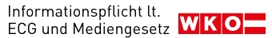

**Impressum und Offenlegung gemäß §§ 24, 25 Mediengesetz sowie Angaben gemäß § 5 ECG**

**Medieninhaber & Herausgeber**  
Florian Reisinger  
Robert-Stolz-Straße 8  
4020 Linz Österreich   

Kontaktdaten:  
E-Mail: florian@reisinger.pictures  
Web: [https://reisinger.pictures](https://reisinger.pictures/impressum#kontakt)
WhatsApp: https://wa.me/message/WCWIDNQAIYSGE1  
Telefon: +43 670 201 77 10

## Unternehmensdaten
Rechtsform: Einzelunternehmer  
Unternehmensgegenstand: Berufsfotografie, Erstellung von visuellen Inhalten  
Kleinunternehmerregelung (umsatzsteuerfrei)  
GISA-Zahl: 39109651
Zuständige Aufsichtsbehörde: Magistrat der Landeshauptstadt Linz  
Kammerzugehörigkeit: Mitglied der Wirtschaftskammer Oberösterreich (WKO), Fachgruppe Berufsfotografie  
Anwendbare Rechtsvorschriften: Gewerbeordnung (GewO), abrufbar unter https://www.ris.bka.gv.at

## Offenlegung gemäß § 25 Mediengesetz
Medieninhaber: Florian Reisinger (Adresse siehe oben)

Blattlinie (Grundlegende Richtung des Mediums): Diese Webseite und der integrierte Blog dienen der Präsentation des Portfolios von Florian Reisinger sowie der Information über dessen Dienstleistungen. Darüber hinaus werden Artikel zu Themen der Fotografie, Bildbearbeitung, Technik und visuellen Gestaltung veröffentlicht, die die persönliche Meinung des Autors widerspiegeln und der Förderung kreativer Tätigkeiten dienen.

## Urheberrecht & Haftung
Die Inhalte dieser Webseite sind urheberrechtlich geschützt. Jede Nutzung, insbesondere die Speicherung in Datenbanken, Vervielfältigung, Verbreitung und jede Form von gewerblicher Nutzung sowie die Weitergabe an Dritte – auch in Teilen oder in überarbeiteter Form – ohne Zustimmung des Betreibers bzw. des Urhebers ist untersagt.

Soweit auf dieser Webseite personenbezogene Bezeichnungen nur in männlicher Form angeführt sind, beziehen sie sich auf Frauen und Männer in gleicher Weise.

Haftung für Links: Trotz sorgfältiger inhaltlicher Kontrolle übernehme ich keine Haftung für die Inhalte externer Links. Für den Inhalt der verlinkten Seiten sind ausschließlich deren Betreiber verantwortlich.

## Logos und Markenrechte
Die auf dieser Webseite verwendeten Logos und Marken dienen ausschließlich der visuellen Darstellung und zur Veranschaulichung. Alle Logos und Marken sind Eigentum ihrer jeweiligen Inhaber.

## Online-Streitbeilegung
Verbraucher haben die Möglichkeit, Beschwerden an die Online-Streitbeilegungsplattform zu richten: https://www.ombudsstelle.at. Sie können allfällige Beschwerde auch an die oben angegebene 
E-Mail-Adresse oder über das Kontaktformular richten.

